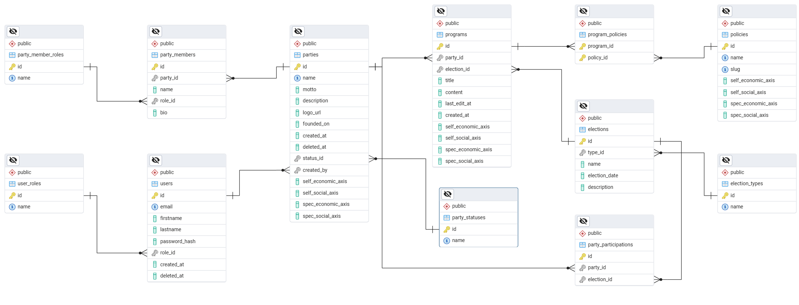

# PolyHub

_Developed by: Teodor Dichev 7MI0600424, Georgi Stoyanov 6MI0600497_

PolyHub is a web application inspired by the need for a common place on the internet for neutral political assessment, where all parties in Bulgaria can share their plans and programs. With upcoming elections and rising interest among youth, such software is becoming increasingly relevant. For reference, take a look at a similar tool that gained massive popularity: [stazha](https://poltest.strazha.bg/).

The application is built using Maven as a build tool and the following technologies:

*   Java (Spring Boot)
*   PostgreSQL
*   Angular

It follows a RESTful, layered architecture. Spring Boot Security is implemented using JWT authentication with HttpOnly cookies and role-based access control.

## Roles and Entities

### Users

There are three types of users:

1.  **PartyAdmin** — can register, log in/out, submit a party for approval, manage the party's program and self-assessment on the political compass. Party members (names, roles, bios) can be added by the party admin but are not system users themselves.

2.  **PolyHubAdmin** — seeded into the database. Can approve or reject party registration requests, manage party admin accounts, and create new PolyHub Specialists. Operates through a dedicated admin dashboard.

3.  **PolyHubSpecialist** — political scientists and domain experts. They create elections, manage policies, and assess each party and its programs on the political compass.

### Parties

Parties are submitted by PartyAdmins and require admin approval before they become visible. Once approved, parties can self-assess their political position and submit election programs. PolyHub Specialists independently assess each party's position on the compass. Both assessments are displayed side by side.

### Programs

Each party can submit one program per election. Programs contain rich text content and are tagged with policies. Party admins can reuse a previous program as a starting point. Both self-assessed and specialist-assessed compass positions are tracked per program.

### Elections

Created by PolyHub Specialists. Each election has a type (Parliamentary, Presidential, Mayoral, Municipal Council), a date, and an optional description. Parties can submit programs for each election they participate in, and vote results can be recorded after the election concludes.

### Policies

Policies are tags created and assessed by PolyHub Specialists. They are attached to programs to indicate the main political priorities of that program. Each policy has a specialist-assessed position on the political compass.

_Note: the application is publicly readable — anyone can browse parties, their programs, and election results without logging in. The goal is to give Bulgarian citizens easy, neutral access to political information. Visitors cannot edit, comment, or rate anything._

## Database

The application uses a PostgreSQL relational database.



The schema includes: `users`, `user_roles`, `parties`, `party_statuses`, `party_members`, `party_member_roles`, `elections`, `election_types`, `party_participations`, `programs`, `policies`, and `program_policies`.

## Endpoints

API documentation is served live via **Swagger UI** at:

```
http://localhost:8080/swagger-ui/index.html
```

The OpenAPI spec (importable into Postman or Insomnia) is available at:

```
http://localhost:8080/v3/api-docs
```

To import into Postman: _Import → Link → paste the api-docs URL_.

## Version 2 Goals

The following features are planned for the next version:

*   **Unit tests** — JUnit and Mockito test coverage for service and repository layers, with CI running tests on each commit
*   **Party members** — full CRUD for party member management (name, role, bio) via the party admin dashboard, visible publicly on the party detail page
*   **Party and member images** — image upload support for party logos and member photos, stored via an object storage solution (e.g. AWS S3 or a local file server)
*   **Containers and deployment** — Dockerize all services and deploy using AWS (ECS/RDS or similar)
